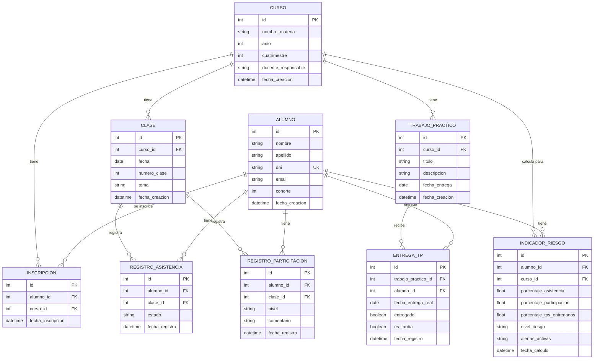
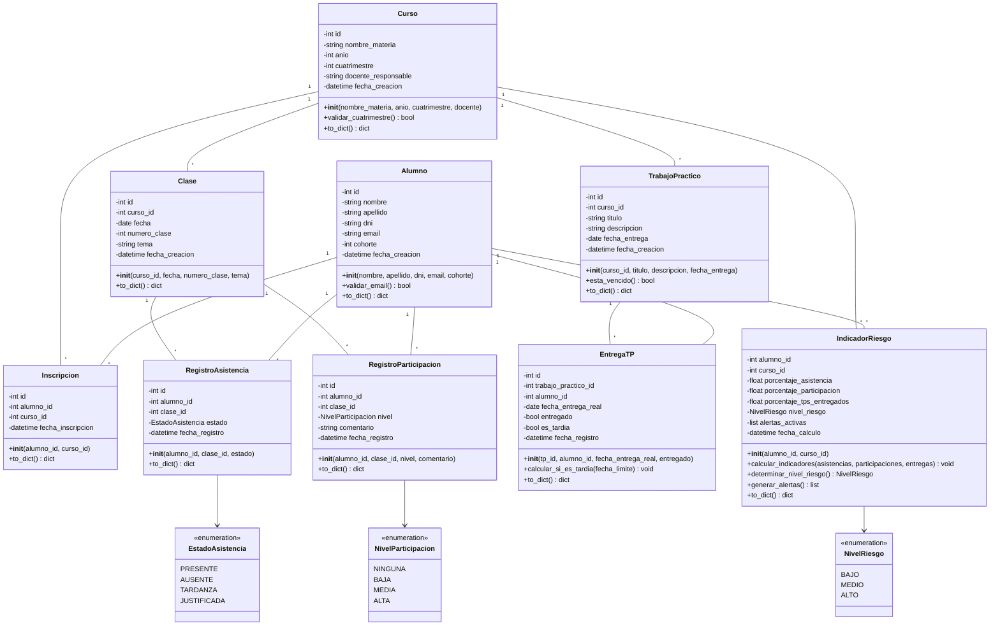
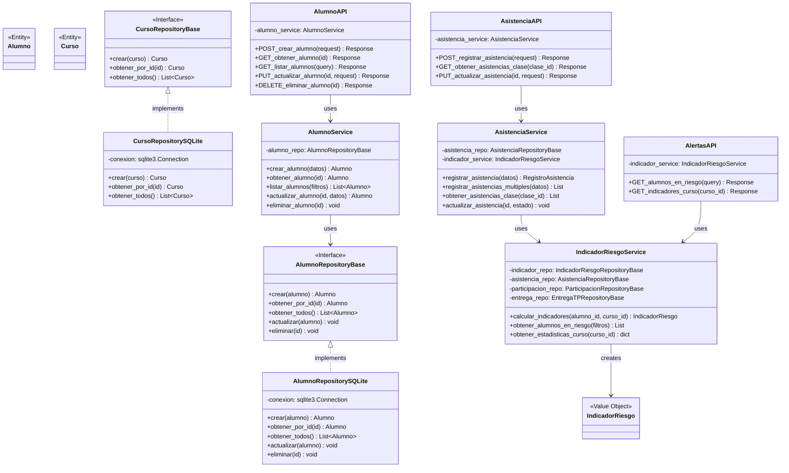
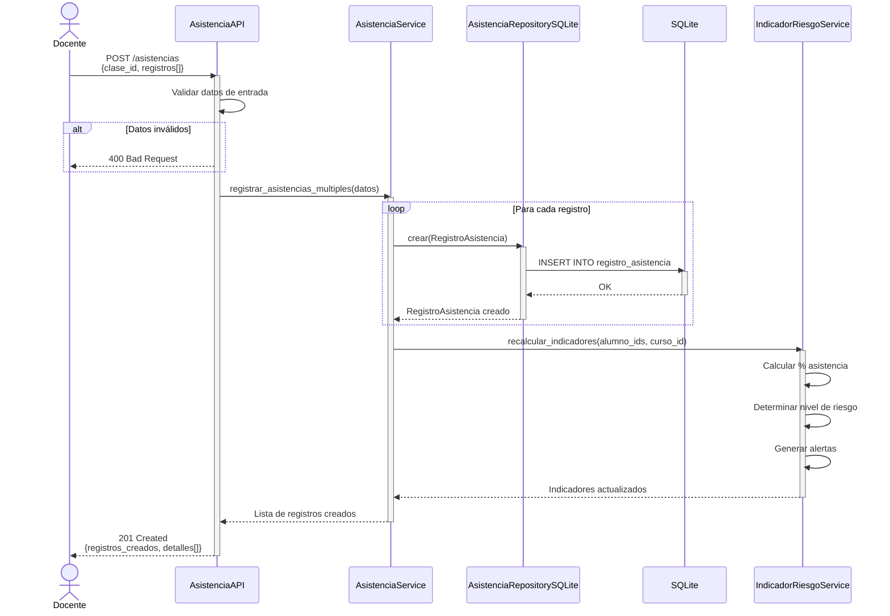
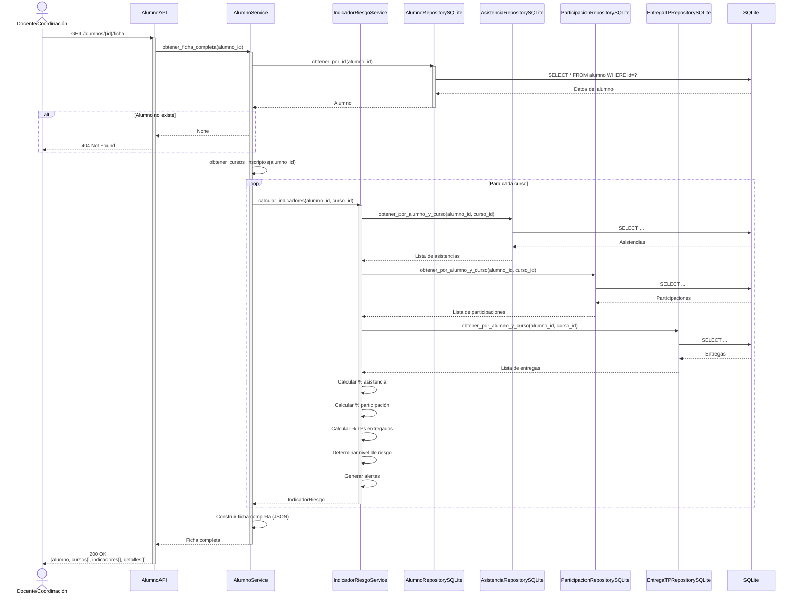
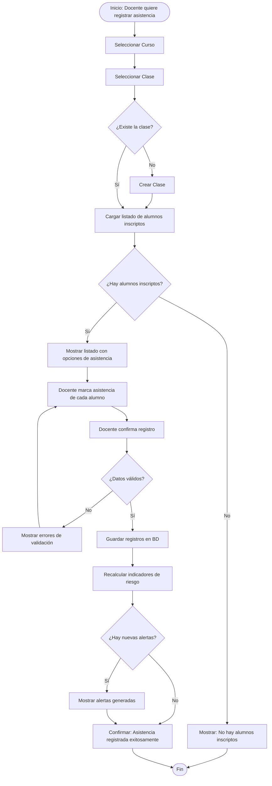
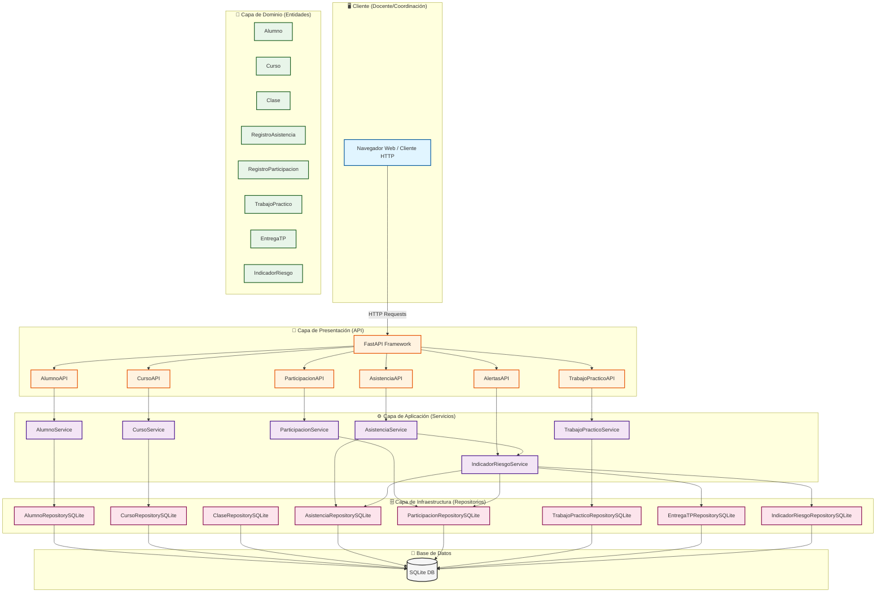

# Modelo de Dominio, API y Diagramas UML

## 1. Modelo de Dominio (Descripción Textual)

### Entidad: Alumno

**Responsabilidad**: Representar a un estudiante de la institución.

**Atributos**:
- `id`: Identificador único
- `nombre`: Nombre del alumno
- `apellido`: Apellido del alumno
- `dni`: Documento Nacional de Identidad (único)
- `email`: Correo electrónico
- `cohorte`: Año de ingreso (ej: 2024)
- `fecha_creacion`: Timestamp de creación del registro

**Relaciones**:
- Un alumno puede estar inscripto en múltiples cursos
- Un alumno tiene múltiples registros de asistencia
- Un alumno tiene múltiples registros de participación
- Un alumno tiene múltiples entregas de TPs
- Un alumno tiene indicadores de riesgo calculados

**Reglas de Negocio**:
- El DNI debe ser único en el sistema
- El email debe tener formato válido
- Un alumno no puede inscribirse dos veces en el mismo curso

---

### Entidad: Curso

**Responsabilidad**: Representar una materia dictada en un período específico.

**Atributos**:
- `id`: Identificador único
- `nombre_materia`: Nombre de la materia (ej: "Programación I")
- `anio`: Año lectivo (ej: 2025)
- `cuatrimestre`: 1 o 2
- `docente_responsable`: Nombre del docente a cargo
- `fecha_creacion`: Timestamp de creación

**Relaciones**:
- Un curso tiene múltiples alumnos inscriptos
- Un curso tiene múltiples clases (sesiones)
- Un curso tiene múltiples trabajos prácticos

**Reglas de Negocio**:
- Un curso debe tener al menos un docente responsable
- El cuatrimestre debe ser 1 o 2

---

### Entidad: Inscripcion

**Responsabilidad**: Relacionar alumnos con cursos.

**Atributos**:
- `id`: Identificador único
- `alumno_id`: Referencia al alumno
- `curso_id`: Referencia al curso
- `fecha_inscripcion`: Fecha de inscripción

**Relaciones**:
- Pertenece a un alumno
- Pertenece a un curso

**Reglas de Negocio**:
- Un alumno no puede tener dos inscripciones al mismo curso
- La inscripción debe existir para registrar asistencia/participación

---

### Entidad: Clase

**Responsabilidad**: Representar una sesión de cursada específica.

**Atributos**:
- `id`: Identificador único
- `curso_id`: Referencia al curso
- `fecha`: Fecha de la clase
- `numero_clase`: Número de clase (ej: 1, 2, 3...)
- `tema`: Tema tratado en la clase
- `fecha_creacion`: Timestamp de creación

**Relaciones**:
- Pertenece a un curso
- Tiene múltiples registros de asistencia
- Tiene múltiples registros de participación

**Reglas de Negocio**:
- Una clase pertenece a un único curso
- El número de clase debe ser único dentro del curso

---

### Entidad: RegistroAsistencia

**Responsabilidad**: Registrar la asistencia de un alumno a una clase.

**Atributos**:
- `id`: Identificador único
- `alumno_id`: Referencia al alumno
- `clase_id`: Referencia a la clase
- `estado`: Presente | Ausente | Tardanza | Justificada
- `fecha_registro`: Timestamp del registro

**Relaciones**:
- Pertenece a un alumno
- Pertenece a una clase

**Reglas de Negocio**:
- Solo puede haber un registro de asistencia por alumno por clase
- El estado debe ser uno de los valores permitidos

---

### Entidad: RegistroParticipacion

**Responsabilidad**: Registrar la participación de un alumno en una clase.

**Atributos**:
- `id`: Identificador único
- `alumno_id`: Referencia al alumno
- `clase_id`: Referencia a la clase
- `nivel`: Ninguna | Baja | Media | Alta
- `comentario`: Comentario opcional del docente
- `fecha_registro`: Timestamp del registro

**Relaciones**:
- Pertenece a un alumno
- Pertenece a una clase

**Reglas de Negocio**:
- Puede haber múltiples registros de participación por alumno por clase
- El nivel debe ser uno de los valores permitidos

---

### Entidad: TrabajoPractico

**Responsabilidad**: Representar un trabajo práctico asignado a un curso.

**Atributos**:
- `id`: Identificador único
- `curso_id`: Referencia al curso
- `titulo`: Título del TP
- `descripcion`: Descripción del TP
- `fecha_entrega`: Fecha límite de entrega
- `fecha_creacion`: Timestamp de creación

**Relaciones**:
- Pertenece a un curso
- Tiene múltiples entregas (una por alumno)

**Reglas de Negocio**:
- Un TP pertenece a un único curso
- La fecha de entrega debe ser futura al momento de creación (idealmente)

---

### Entidad: EntregaTP

**Responsabilidad**: Registrar la entrega de un TP por parte de un alumno.

**Atributos**:
- `id`: Identificador único
- `trabajo_practico_id`: Referencia al TP
- `alumno_id`: Referencia al alumno
- `fecha_entrega_real`: Fecha en que el alumno entregó
- `entregado`: Boolean (True si entregó, False si no)
- `es_tardia`: Boolean (True si entregó después de la fecha límite)
- `fecha_registro`: Timestamp del registro

**Relaciones**:
- Pertenece a un trabajo práctico
- Pertenece a un alumno

**Reglas de Negocio**:
- Solo puede haber una entrega por alumno por TP
- Si `fecha_entrega_real` > `fecha_entrega` del TP, entonces `es_tardia` = True

---

### Entidad: IndicadorRiesgo (Value Object / Calculado)

**Responsabilidad**: Representar los indicadores de riesgo de un alumno en un curso.

**Atributos**:
- `alumno_id`: Referencia al alumno
- `curso_id`: Referencia al curso
- `porcentaje_asistencia`: Float (0-100)
- `porcentaje_participacion`: Float (0-100) o nivel promedio
- `porcentaje_tps_entregados`: Float (0-100)
- `nivel_riesgo`: Bajo | Medio | Alto
- `alertas_activas`: Lista de alertas (ej: ["Asistencia < 70%", "TPs < 50%"])
- `fecha_calculo`: Timestamp del último cálculo

**Relaciones**:
- Pertenece a un alumno
- Pertenece a un curso

**Reglas de Negocio**:
- Se calcula automáticamente al registrar asistencia, participación o entregas
- **Nivel de riesgo**:
  - **Bajo**: Asistencia >= 80%, TPs >= 70%, Participación >= Media
  - **Medio**: Asistencia 70-79%, TPs 50-69%, o Participación Baja
  - **Alto**: Asistencia < 70%, TPs < 50%, o Participación Ninguna sostenida

---

### Entidad: Usuario (Futuro - No en MVP)

**Responsabilidad**: Representar un usuario del sistema con credenciales.

**Atributos**:
- `id`: Identificador único
- `username`: Nombre de usuario
- `password_hash`: Hash de la contraseña
- `email`: Email
- `rol`: Docente | Coordinacion | Estudiante | Admin
- `activo`: Boolean

**Relaciones**:
- Un usuario puede estar asociado a un alumno (si es estudiante)
- Un usuario puede estar asociado a un docente (si es docente)

**Reglas de Negocio**:
- El username debe ser único
- La contraseña debe almacenarse hasheada (bcrypt)
- Los roles determinan los permisos

---

## 2. Diseño de la API

### Principios de Diseño

- **REST-like**: Uso de verbos HTTP estándar (GET, POST, PUT, DELETE)
- **Recursos**: URLs representan recursos (alumnos, cursos, clases, etc.)
- **JSON**: Formato de intercambio de datos
- **Códigos HTTP**: Uso correcto de códigos de estado (200, 201, 400, 404, 500)
- **Validación**: Validación de datos de entrada en cada endpoint
- **Idempotencia**: GET, PUT, DELETE son idempotentes

---

### Endpoints de la API

#### **Gestión de Alumnos**

##### `POST /alumnos`
**Descripción**: Crear un nuevo alumno.

**Request Body**:
```json
{
  "nombre": "Juan",
  "apellido": "Pérez",
  "dni": "12345678",
  "email": "juan.perez@example.com",
  "cohorte": 2024
}
```

**Response** (201 Created):
```json
{
  "id": 1,
  "nombre": "Juan",
  "apellido": "Pérez",
  "dni": "12345678",
  "email": "juan.perez@example.com",
  "cohorte": 2024,
  "fecha_creacion": "2025-12-07T12:00:00Z"
}
```

**Validaciones**:
- `nombre`, `apellido`, `dni`, `email` son obligatorios
- `dni` debe ser único
- `email` debe tener formato válido
- `cohorte` debe ser un año válido (>= 2000)

**Errores**:
- `400 Bad Request`: Datos inválidos o faltantes
- `409 Conflict`: DNI ya existe

---

##### `GET /alumnos/{id}`
**Descripción**: Obtener datos de un alumno específico.

**Response** (200 OK):
```json
{
  "id": 1,
  "nombre": "Juan",
  "apellido": "Pérez",
  "dni": "12345678",
  "email": "juan.perez@example.com",
  "cohorte": 2024,
  "fecha_creacion": "2025-12-07T12:00:00Z"
}
```

**Errores**:
- `404 Not Found`: Alumno no existe

---

##### `GET /alumnos`
**Descripción**: Listar todos los alumnos (con filtros opcionales).

**Query Parameters**:
- `cohorte` (opcional): Filtrar por cohorte
- `nombre` (opcional): Buscar por nombre (parcial)

**Response** (200 OK):
```json
{
  "total": 50,
  "alumnos": [
    {
      "id": 1,
      "nombre": "Juan",
      "apellido": "Pérez",
      "dni": "12345678",
      "email": "juan.perez@example.com",
      "cohorte": 2024
    },
    ...
  ]
}
```

---

##### `PUT /alumnos/{id}`
**Descripción**: Actualizar datos de un alumno.

**Request Body**:
```json
{
  "email": "nuevo.email@example.com",
  "cohorte": 2025
}
```

**Response** (200 OK): Alumno actualizado.

**Errores**:
- `404 Not Found`: Alumno no existe
- `400 Bad Request`: Datos inválidos

---

##### `DELETE /alumnos/{id}`
**Descripción**: Eliminar un alumno (soft delete recomendado).

**Response** (204 No Content).

**Errores**:
- `404 Not Found`: Alumno no existe

---

#### **Gestión de Cursos**

##### `POST /cursos`
**Descripción**: Crear un nuevo curso.

**Request Body**:
```json
{
  "nombre_materia": "Programación I",
  "anio": 2025,
  "cuatrimestre": 1,
  "docente_responsable": "Prof. García"
}
```

**Response** (201 Created):
```json
{
  "id": 1,
  "nombre_materia": "Programación I",
  "anio": 2025,
  "cuatrimestre": 1,
  "docente_responsable": "Prof. García",
  "fecha_creacion": "2025-12-07T12:00:00Z"
}
```

**Validaciones**:
- Todos los campos son obligatorios
- `cuatrimestre` debe ser 1 o 2
- `anio` debe ser >= año actual - 5

---

##### `GET /cursos/{id}`
**Descripción**: Obtener datos de un curso.

**Response** (200 OK): Datos del curso.

---

##### `GET /cursos`
**Descripción**: Listar todos los cursos.

**Query Parameters**:
- `anio` (opcional)
- `cuatrimestre` (opcional)

**Response** (200 OK): Lista de cursos.

---

#### **Gestión de Inscripciones**

##### `POST /inscripciones`
**Descripción**: Inscribir un alumno a un curso.

**Request Body**:
```json
{
  "alumno_id": 1,
  "curso_id": 1
}
```

**Response** (201 Created):
```json
{
  "id": 1,
  "alumno_id": 1,
  "curso_id": 1,
  "fecha_inscripcion": "2025-12-07T12:00:00Z"
}
```

**Validaciones**:
- El alumno y el curso deben existir
- El alumno no puede estar ya inscripto en ese curso

**Errores**:
- `404 Not Found`: Alumno o curso no existe
- `409 Conflict`: Alumno ya inscripto

---

##### `GET /cursos/{curso_id}/alumnos`
**Descripción**: Listar alumnos inscriptos en un curso.

**Response** (200 OK):
```json
{
  "curso_id": 1,
  "total_alumnos": 25,
  "alumnos": [
    {
      "id": 1,
      "nombre": "Juan",
      "apellido": "Pérez",
      "fecha_inscripcion": "2025-03-01T00:00:00Z"
    },
    ...
  ]
}
```

---

#### **Gestión de Clases**

##### `POST /clases`
**Descripción**: Crear una nueva clase (sesión).

**Request Body**:
```json
{
  "curso_id": 1,
  "fecha": "2025-12-07",
  "numero_clase": 10,
  "tema": "Recursividad"
}
```

**Response** (201 Created):
```json
{
  "id": 1,
  "curso_id": 1,
  "fecha": "2025-12-07",
  "numero_clase": 10,
  "tema": "Recursividad",
  "fecha_creacion": "2025-12-07T12:00:00Z"
}
```

**Validaciones**:
- `curso_id` debe existir
- `fecha` debe ser válida
- `numero_clase` debe ser > 0

---

##### `GET /clases/{id}`
**Descripción**: Obtener datos de una clase.

**Response** (200 OK): Datos de la clase.

---

##### `GET /cursos/{curso_id}/clases`
**Descripción**: Listar todas las clases de un curso.

**Response** (200 OK): Lista de clases.

---

#### **Registro de Asistencia**

##### `POST /asistencias`
**Descripción**: Registrar asistencia de uno o varios alumnos a una clase.

**Request Body** (opción 1: un alumno):
```json
{
  "alumno_id": 1,
  "clase_id": 1,
  "estado": "Presente"
}
```

**Request Body** (opción 2: múltiples alumnos):
```json
{
  "clase_id": 1,
  "registros": [
    {"alumno_id": 1, "estado": "Presente"},
    {"alumno_id": 2, "estado": "Ausente"},
    {"alumno_id": 3, "estado": "Tardanza"}
  ]
}
```

**Response** (201 Created):
```json
{
  "registros_creados": 3,
  "detalles": [
    {"alumno_id": 1, "estado": "Presente"},
    {"alumno_id": 2, "estado": "Ausente"},
    {"alumno_id": 3, "estado": "Tardanza"}
  ]
}
```

**Validaciones**:
- `clase_id` debe existir
- `alumno_id` debe existir y estar inscripto en el curso de la clase
- `estado` debe ser: Presente | Ausente | Tardanza | Justificada

**Errores**:
- `404 Not Found`: Clase o alumno no existe
- `400 Bad Request`: Estado inválido o alumno no inscripto

---

##### `GET /clases/{clase_id}/asistencias`
**Descripción**: Obtener todas las asistencias de una clase.

**Response** (200 OK):
```json
{
  "clase_id": 1,
  "fecha": "2025-12-07",
  "total_alumnos": 25,
  "asistencias": [
    {"alumno_id": 1, "nombre": "Juan Pérez", "estado": "Presente"},
    {"alumno_id": 2, "nombre": "Ana García", "estado": "Ausente"},
    ...
  ]
}
```

---

##### `PUT /asistencias/{id}`
**Descripción**: Modificar un registro de asistencia existente.

**Request Body**:
```json
{
  "estado": "Justificada"
}
```

**Response** (200 OK): Registro actualizado.

---

#### **Registro de Participación**

##### `POST /participaciones`
**Descripción**: Registrar participación de un alumno en una clase.

**Request Body**:
```json
{
  "alumno_id": 1,
  "clase_id": 1,
  "nivel": "Alta",
  "comentario": "Excelente pregunta sobre recursividad"
}
```

**Response** (201 Created):
```json
{
  "id": 1,
  "alumno_id": 1,
  "clase_id": 1,
  "nivel": "Alta",
  "comentario": "Excelente pregunta sobre recursividad",
  "fecha_registro": "2025-12-07T14:30:00Z"
}
```

**Validaciones**:
- `nivel` debe ser: Ninguna | Baja | Media | Alta
- `comentario` es opcional

---

##### `GET /clases/{clase_id}/participaciones`
**Descripción**: Obtener todas las participaciones de una clase.

**Response** (200 OK): Lista de participaciones.

---

#### **Gestión de Trabajos Prácticos**

##### `POST /trabajos-practicos`
**Descripción**: Crear un nuevo trabajo práctico.

**Request Body**:
```json
{
  "curso_id": 1,
  "titulo": "TP1 - Estructuras de Datos",
  "descripcion": "Implementar listas, pilas y colas",
  "fecha_entrega": "2025-12-15"
}
```

**Response** (201 Created):
```json
{
  "id": 1,
  "curso_id": 1,
  "titulo": "TP1 - Estructuras de Datos",
  "descripcion": "Implementar listas, pilas y colas",
  "fecha_entrega": "2025-12-15",
  "fecha_creacion": "2025-12-07T12:00:00Z"
}
```

---

##### `GET /trabajos-practicos/{id}`
**Descripción**: Obtener datos de un TP.

**Response** (200 OK): Datos del TP.

---

##### `GET /cursos/{curso_id}/trabajos-practicos`
**Descripción**: Listar todos los TPs de un curso.

**Response** (200 OK): Lista de TPs.

---

#### **Registro de Entregas de TPs**

##### `POST /entregas-tp`
**Descripción**: Registrar que un alumno entregó un TP.

**Request Body**:
```json
{
  "trabajo_practico_id": 1,
  "alumno_id": 1,
  "fecha_entrega_real": "2025-12-14",
  "entregado": true
}
```

**Response** (201 Created):
```json
{
  "id": 1,
  "trabajo_practico_id": 1,
  "alumno_id": 1,
  "fecha_entrega_real": "2025-12-14",
  "entregado": true,
  "es_tardia": false,
  "fecha_registro": "2025-12-14T18:00:00Z"
}
```

**Validaciones**:
- El TP y el alumno deben existir
- El alumno debe estar inscripto en el curso del TP
- Si `fecha_entrega_real` > `fecha_entrega` del TP, marcar `es_tardia` = true

---

##### `GET /trabajos-practicos/{tp_id}/entregas`
**Descripción**: Listar todas las entregas de un TP.

**Response** (200 OK):
```json
{
  "trabajo_practico_id": 1,
  "titulo": "TP1 - Estructuras de Datos",
  "total_alumnos": 25,
  "entregas": [
    {"alumno_id": 1, "nombre": "Juan Pérez", "entregado": true, "es_tardia": false},
    {"alumno_id": 2, "nombre": "Ana García", "entregado": false, "es_tardia": null},
    ...
  ]
}
```

---

#### **Consulta de Ficha de Alumno**

##### `GET /alumnos/{id}/ficha`
**Descripción**: Obtener ficha completa de un alumno con todos sus indicadores.

**Query Parameters**:
- `curso_id` (opcional): Filtrar por curso específico

**Response** (200 OK):
```json
{
  "alumno": {
    "id": 1,
    "nombre": "Juan",
    "apellido": "Pérez",
    "dni": "12345678",
    "email": "juan.perez@example.com",
    "cohorte": 2024
  },
  "cursos": [
    {
      "curso_id": 1,
      "nombre_materia": "Programación I",
      "anio": 2025,
      "cuatrimestre": 1,
      "indicadores": {
        "porcentaje_asistencia": 80.0,
        "porcentaje_participacion": 60.0,
        "porcentaje_tps_entregados": 80.0,
        "nivel_riesgo": "Medio",
        "alertas_activas": ["Asistencia por debajo del 85%"]
      },
      "detalle_asistencias": {
        "total_clases": 10,
        "presentes": 8,
        "ausentes": 2,
        "tardanzas": 0,
        "justificadas": 0
      },
      "detalle_participaciones": {
        "total_registros": 5,
        "nivel_promedio": "Media"
      },
      "detalle_tps": {
        "total_tps": 5,
        "entregados": 4,
        "no_entregados": 1,
        "tardios": 0
      }
    }
  ]
}
```

---

#### **Consulta de Alertas y Riesgo**

##### `GET /alertas/alumnos-en-riesgo`
**Descripción**: Listar todos los alumnos en riesgo.

**Query Parameters**:
- `nivel` (opcional): Filtrar por nivel de riesgo (Bajo | Medio | Alto)
- `curso_id` (opcional): Filtrar por curso

**Response** (200 OK):
```json
{
  "total": 5,
  "alumnos_en_riesgo": [
    {
      "alumno_id": 2,
      "nombre": "Pedro Gómez",
      "cursos": [
        {
          "curso_id": 1,
          "nombre_materia": "Programación I",
          "nivel_riesgo": "Alto",
          "alertas_activas": [
            "Asistencia < 70%",
            "TPs entregados < 50%"
          ],
          "indicadores": {
            "porcentaje_asistencia": 60.0,
            "porcentaje_tps_entregados": 40.0
          }
        }
      ]
    },
    ...
  ]
}
```

---

##### `GET /cursos/{curso_id}/indicadores`
**Descripción**: Obtener estadísticas e indicadores generales de un curso.

**Response** (200 OK):
```json
{
  "curso_id": 1,
  "nombre_materia": "Programación I",
  "total_alumnos": 25,
  "estadisticas": {
    "promedio_asistencia": 82.5,
    "promedio_tps_entregados": 75.0,
    "alumnos_riesgo_bajo": 15,
    "alumnos_riesgo_medio": 7,
    "alumnos_riesgo_alto": 3
  }
}
```

---

## 3. Diagramas UML en Mermaid

### 3.1 Diagrama Entidad-Relación (ER)



---

### 3.2 Diagrama de Clases (Dominio)



---

### 3.3 Diagrama de Clases (Arquitectura Completa)



---

### 3.4 Diagrama de Secuencia: Registrar Asistencia vía API



---

### 3.5 Diagrama de Secuencia: Consultar Ficha de Alumno



---

### 3.6 Diagrama de Actividad: Registrar Asistencia de una Clase



---

### 3.7 Diagrama de Componentes (Arquitectura por Capas)



---

**Siguiente documento**: [Estructura del Proyecto y Trazabilidad](./04_ESTRUCTURA_Y_TRAZABILIDAD.md)
